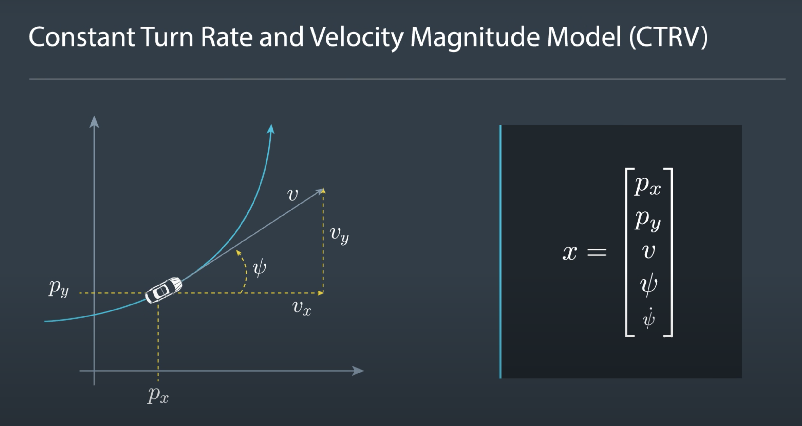
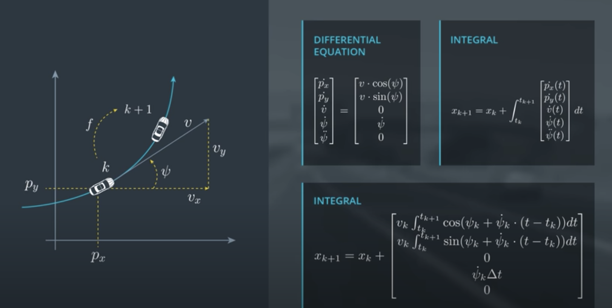
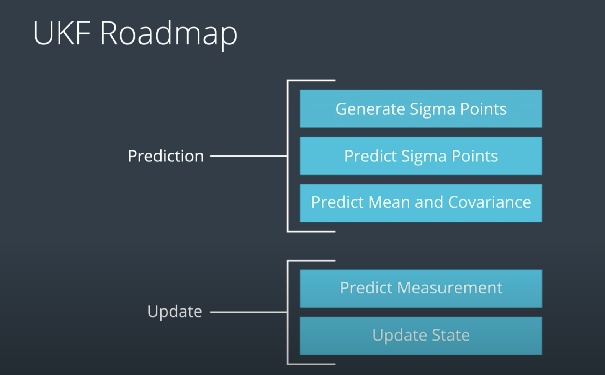
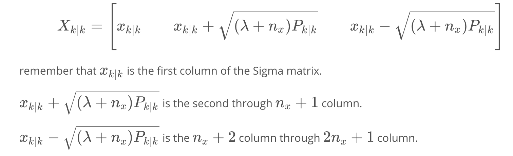
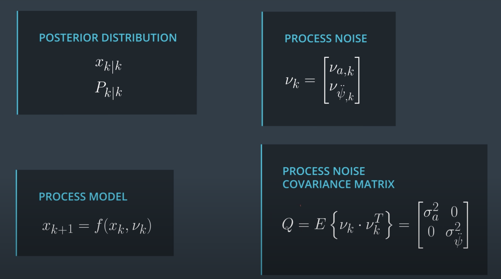
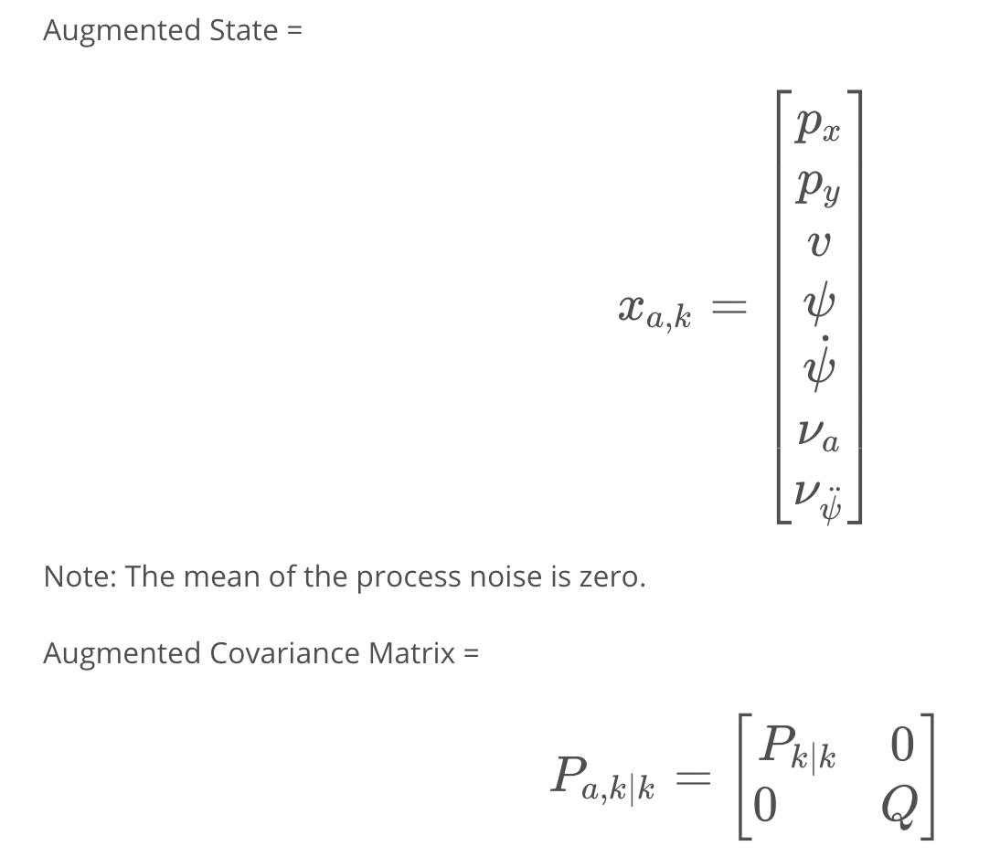
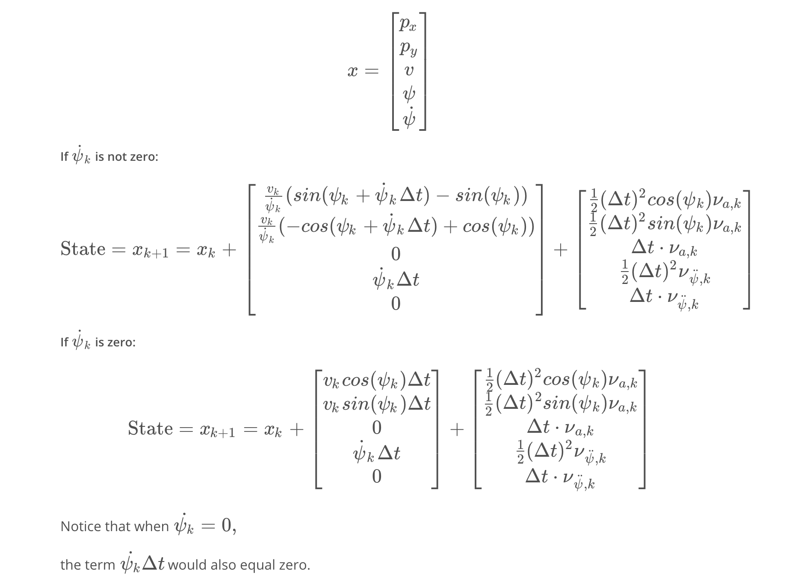
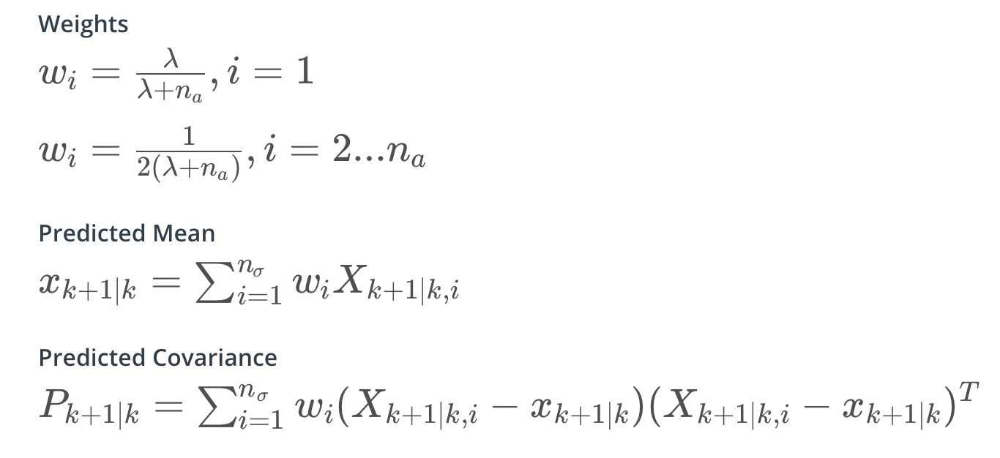
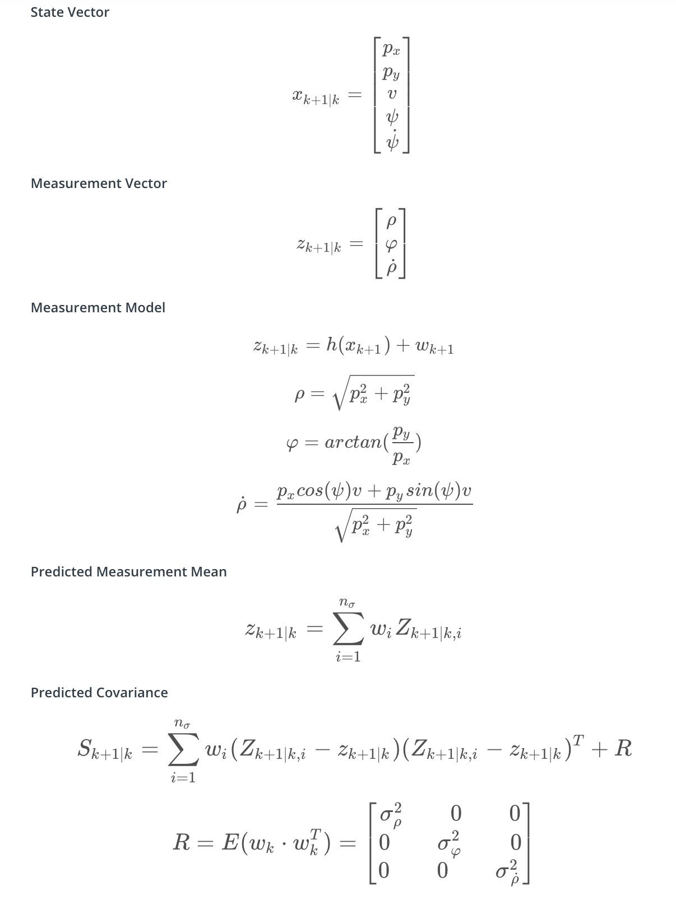
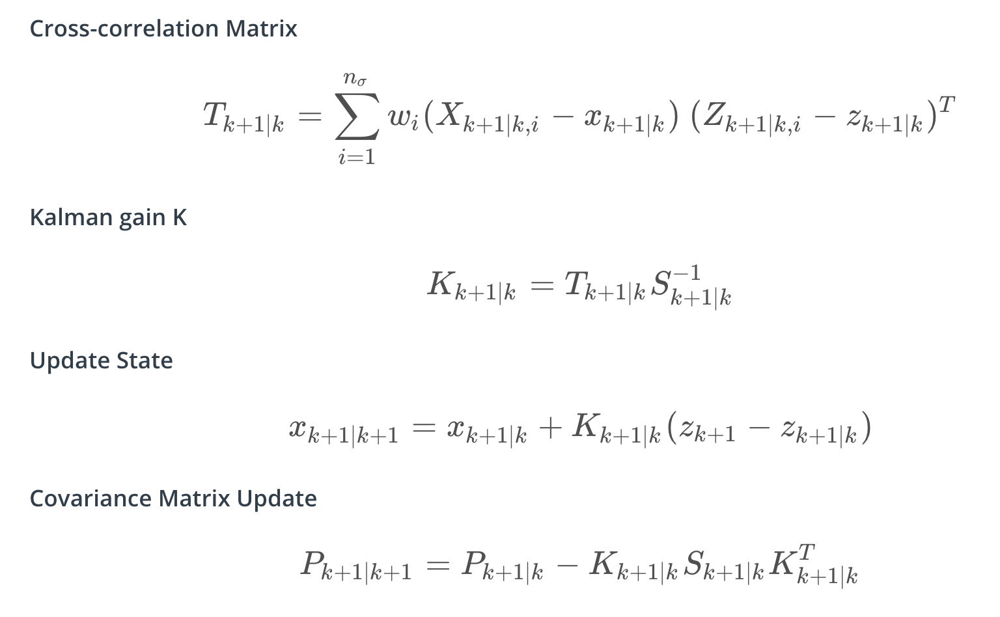

# SFND_Unscented_Kalman_Filter
Sensor Fusion UKF Highway Project For Object Tracking 


This project is about to implement an Unscented Kalman Filter to estimate the state of multiple cars on a highway using noisy lidar and radar measurements. 

The main program can be built and ran by doing the following from the project top directory.

1. mkdir build
2. cd build
3. cmake ..
4. make
5. ./ukf_highway


`main.cpp` is using `highway.h` to create a straight 3 lane highway environment with 3 traffic cars and the main ego car at the center. 
The viewer scene is centered around the ego car and the coordinate system is relative to the ego car as well. The ego car is green while the 
other traffic cars are blue. The traffic cars will be accelerating and altering their steering to change lanes. Each of the traffic car's has it's own UKF object generated for it, and will update each indidual one during every time step. 

The red spheres above cars represent the (x,y) lidar detection and the purple lines show the radar measurements with the velocity magnitude along the detected angle. The Z axis is not taken into account for tracking, so only the X/Y axis are tracking along.

---

## Other Important Dependencies
* cmake >= 3.5
  * All OSes: [click here for installation instructions](https://cmake.org/install/)
* make >= 4.1 (Linux, Mac), 3.81 (Windows)
  * Linux: make is installed by default on most Linux distros
  * Mac: [install Xcode command line tools to get make](https://developer.apple.com/xcode/features/)
  * Windows: [Click here for installation instructions](http://gnuwin32.sourceforge.net/packages/make.htm)
* gcc/g++ >= 5.4
  * Linux: gcc / g++ is installed by default on most Linux distros
  * Mac: same deal as make - [install Xcode command line tools](https://developer.apple.com/xcode/features/)
  * Windows: recommend using [MinGW](http://www.mingw.org/)
 * PCL 1.2

## Motion Model Choosing 
Here, constant turn rate and velocity magnitude model (CTRV) is chosen. 



[From Udacity]

## UKF Implementation Description 


[From Udacity]

### Prediction 

#### Generate Sigma Points 
This is sigma points generation formula. 


[From Udacity]

Inorder to process noise, we need Augmented State to calculate Augmented Sigma Points. 


[From Udacity]



[From Udacity]

### Sigma Points Prediction 


[From Udacity]

### Predict Mean and Covariance 


[From Udacity]

### C++ Implementation for UKF Prediction 
```
void UKF::Prediction(double delta_t) {
  /**
   * TODO: Complete this function! Estimate the object's location. 
   * Modify the state vector, x_. Predict sigma points, the state, 
   * and the state covariance matrix.
   */
  // Generate Sigma Points 
  // Get Xsig_aug
  MatrixXd Xsig_aug(n_aug_, 2 * n_aug_ + 1);

  VectorXd x_aug(n_aug_);
  x_aug.setZero();
  x_aug.head(n_x_) = x_;

  MatrixXd P_aug(n_aug_, n_aug_);
  P_aug.setZero();
  P_aug.topLeftCorner(n_x_, n_x_) = P_;
  P_aug(n_x_, n_x_) = pow(std_a_, 2);
  P_aug(n_x_ + 1, n_x_ + 1) = pow(std_yawdd_, 2); 

  Xsig_aug.setZero();
  Xsig_aug.col(0) = x_aug;
  Eigen::MatrixXd A = P_aug.llt().matrixL(); // sqrt of P_aug
  Xsig_aug.block(0, 1, n_aug_, n_aug_) = (sqrt(lambda_ + n_aug_) * A).colwise() + x_aug;
  Xsig_aug.block(0, n_aug_ + 1, n_aug_, n_aug_) = (-sqrt(lambda_ + n_aug_) * A).colwise() + x_aug;

  // Update Xsig_pred_
  VectorXd x_delta(5), x_noise(5);
  for (int i = 0; i < 2 * n_aug_ + 1; ++i) {
    double p_x = Xsig_aug(0, i); 
    double p_y = Xsig_aug(1, i);
    double v = Xsig_aug(2, i);
    double yaw = Xsig_aug(3, i);
    double yawd = Xsig_aug(4, i);
    double std_a = Xsig_aug(5, i);
    double std_yawdd = Xsig_aug(6, i); 
    
    x_noise(0) = 0.5 * pow(delta_t, 2) * cos(yaw) * std_a; 
    x_noise(1) = 0.5 * pow(delta_t, 2) * sin(yaw) * std_a;
    x_noise(2) = delta_t * std_a;
    x_noise(3) = 0.5 * pow(delta_t, 2) * std_yawdd;
    x_noise(4) = delta_t * std_yawdd;
    
    if (fabs(yawd) < 0.001) {
      x_delta(0) = v * cos(yaw) * delta_t;
      x_delta(1) = v * sin(yaw) * delta_t;
    }
    else {
      x_delta(0) = v / yawd * (sin(yaw + yawd * delta_t) - sin(yaw));
      x_delta(1) = v / yawd * (-cos(yaw + yawd * delta_t) + cos(yaw));
    }
    x_delta(2) = 0;
    x_delta(3) = yawd * delta_t;
    x_delta(4) = 0; 
    
    Xsig_pred_.col(i) = Xsig_aug.col(i).head(5) + x_delta + x_noise;
  }

  // Get predicted mean and covariance 
  // predict state mean 
  VectorXd x(n_x_);
  x.setZero();
  for (int i = 0; i < 2 * n_aug_ + 1; ++i) {
    x += weights_(i) * Xsig_pred_.col(i);
  }
  // predict state covariance matrix
  MatrixXd P(n_x_, n_x_);
  P.setZero();
  for (int i = 0; i < 2 * n_aug_ + 1; ++i) {
    VectorXd x_diff = Xsig_pred_.col(i) - x;
    NormalizeAngleOnComponent(x_diff, 3);
    P += weights_(i) * x_diff * x_diff.transpose();
  }

  // update x_ and P_
  x_ = x;
  P_ = P;

}

```

### Update 

### Predict Measurement 
We have radar and lidar measurements, and lidar measurement model is much straightforward, so here we provide the process for predicting radar measurement. 


[From Udacity]

### UKF Update


[From Udacity]

### C++ Implementation for UKF Update
C++ implementation for lidar:
```
void UKF::UpdateLidar(MeasurementPackage meas_package) {
  /**
   * TODO: Complete this function! Use lidar data to update the belief 
   * about the object's position. Modify the state vector, x_, and 
   * covariance, P_.
   * You can also calculate the lidar NIS, if desired.
   */
  int n_z = 2;
  // create matrix for sigma points in measurement space
  MatrixXd Zsig = MatrixXd(n_z, 2 * n_aug_ + 1);

  // mean predicted measurement
  VectorXd z_pred = VectorXd(n_z);
  
  // measurement covariance matrix S
  MatrixXd S = MatrixXd(n_z, n_z);

  // transform sigma points into measurement space
  for (int i = 0; i < 2 * n_aug_ + 1; ++i) {
      Zsig(0, i) = Xsig_pred_(0, i);
      Zsig(1, i) = Xsig_pred_(1, i);
  }

  // calculate mean predicted measurement
  z_pred.setZero();
  for (int i = 0; i < 2 * n_aug_ + 1; ++i) {
      z_pred += weights_(i) * Zsig.col(i);
  }
  // calculate innovation covariance matrix S
  S.setZero();
  for (int i = 0; i < 2 * n_aug_ + 1; ++i) {
      VectorXd z_diff = Zsig.col(i) - z_pred; 
      S += z_diff * z_diff.transpose() * weights_(i);
  }
  MatrixXd R = MatrixXd::Identity(2, 2); 
  R(0, 0) = pow(std_laspx_, 2);
  R(1, 1) = pow(std_laspy_, 2);
  
  S += R;

  // Update state and covariance 
  // create matrix for cross correlation Tc
  MatrixXd Tc(n_x_, n_z);
  // calculate cross correlation matrix
  Tc.setZero();
  for (int i = 0; i < 2 * n_aug_ + 1; ++i) {
    Tc += weights_(i) * (Xsig_pred_.col(i) - x_) * (Zsig.col(i) - z_pred).transpose();
  }

  // calculate Kalman gain K;
  MatrixXd K = Tc * S.inverse();

  // residual
  VectorXd z_diff = meas_package.raw_measurements_ - z_pred;

  // update state mean and covariance matrix
  x_ += K * (z_diff);
  P_ -= K * S * K.transpose(); 

  double nis_lidar = z_diff.transpose() * S.inverse() * z_diff;
  std::cout << "nis_lidar = " << nis_lidar << std::endl;
}
```

C++ implementation for radar:
```
void UKF::UpdateRadar(MeasurementPackage meas_package) {
  /**
   * TODO: Complete this function! Use radar data to update the belief 
   * about the object's position. Modify the state vector, x_, and 
   * covariance, P_.
   * You can also calculate the radar NIS, if desired.
   */
  // Predict measurement 
  int n_z = 3;

  // create matrix for sigma points in measurement space
  MatrixXd Zsig = MatrixXd(n_z, 2 * n_aug_ + 1);

  // mean predicted measurement
  VectorXd z_pred = VectorXd(n_z);
  
  // measurement covariance matrix S
  MatrixXd S = MatrixXd(n_z, n_z);

  // transform sigma points into measurement space
  for (int i = 0; i < 2 * n_aug_ + 1; ++i) {
      double px = Xsig_pred_(0, i);
      double py = Xsig_pred_(1, i);
      double v = Xsig_pred_(2, i);
      double yaw = Xsig_pred_(3, i); 
      
      double r = sqrt(pow(px, 2) + pow(py, 2));
      Zsig(0, i) = r; 
      Zsig(1, i) = atan2(py, px); 
      Zsig(2, i) = (v * cos(yaw) * px + v * sin(yaw) * py) / r; 
  }

  // calculate mean predicted measurement
  z_pred.setZero();
  for (int i = 0; i < 2 * n_aug_ + 1; ++i) {
      z_pred += weights_(i) * Zsig.col(i);
  }
  // calculate innovation covariance matrix S
  S.setZero();
  for (int i = 0; i < 2 * n_aug_ + 1; ++i) {
      VectorXd z_diff = Zsig.col(i) - z_pred; 
      // angle normalization
      NormalizeAngleOnComponent(z_diff, 1);
      S += z_diff * z_diff.transpose() * weights_(i);
  }
  MatrixXd R = MatrixXd::Identity(3, 3); 
  R(0, 0) = pow(std_radr_, 2);
  R(1, 1) = pow(std_radphi_, 2);
  R(2, 2) = pow(std_radrd_, 2); 
  
  S += R;

  // Update state and covariance 
  // create matrix for cross correlation Tc
  MatrixXd Tc(n_x_, n_z);
  // calculate cross correlation matrix
  Tc.setZero();
  for (int i = 0; i < 2 * n_aug_ + 1; ++i) {
    // std::cout << "Zsig.col(" << i << "):" << Zsig.col(i) << std::endl;
    // std::cout << "z_pred:" << z_pred << std::endl;
    // std::cout << "Xsig_pred_.col(" << i << "):" << Xsig_pred_.col(i) << std::endl;
    // std::cout << "x_:" << x_ << std::endl;
    // residual
    VectorXd z_diff = Zsig.col(i) - z_pred;
    // angle normalization
    NormalizeAngleOnComponent(z_diff, 1);

    // state difference
    VectorXd x_diff = Xsig_pred_.col(i) - x_;
    // angle normalization
    NormalizeAngleOnComponent(x_diff, 3);

    Tc += weights_(i) * x_diff * z_diff.transpose();
  }

  // calculate Kalman gain K;
  MatrixXd K = Tc * S.inverse();

  // residual
  VectorXd z_diff = meas_package.raw_measurements_ - z_pred;

  // angle normalization
  NormalizeAngleOnComponent(z_diff, 1);

  // update state mean and covariance matrix
  x_ += K * z_diff;
  P_ -= K * S * K.transpose(); 

  double nis_radar = z_diff.transpose() * S.inverse() * z_diff;
  std::cout << "nis_radar = " << nis_radar << std::endl;
}
```

